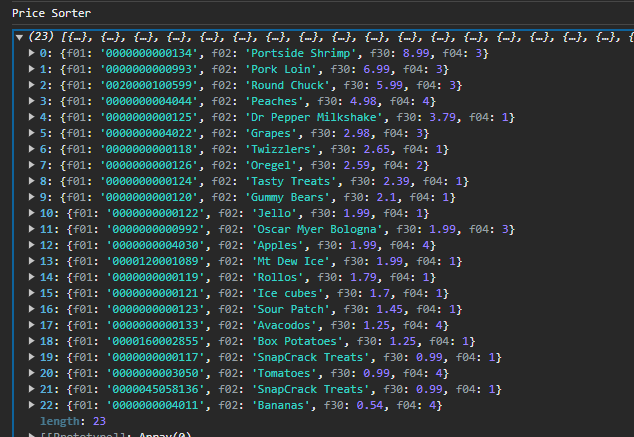

# interview tests

just have a little fun and see if you can get the tests to pass. There are two projects inside of this repo. JS and TS. You can choose door number 1 if you prefer working in Javascript or door number 2 if you prefer to work in Typescript.

## PriceSorter

for this test, we just need to sort all the items from the highest priced to the lowest priced. The end result should look something  like this:

##  Best Sellers

for this test we need the two highest selling unique items that sold between 7/1 and 8/1. It should look something like this

### bonus

if you really want to get krafty, add the item information and the department so that it looks like this:

feel free to use the index.js or index.ts (depending on which door you choose) as your playground to get your function correct before running the tests to see if they pass or not.

### There is also a fastApi to test your skills
in the POST endpoint, pass in a list of numbers and sum up only the even ones. If you pass in [1,2,3,4,5,6,7,8,9] you should get a result of 20.

in the GET endpoint, return all the peeps back in json format

